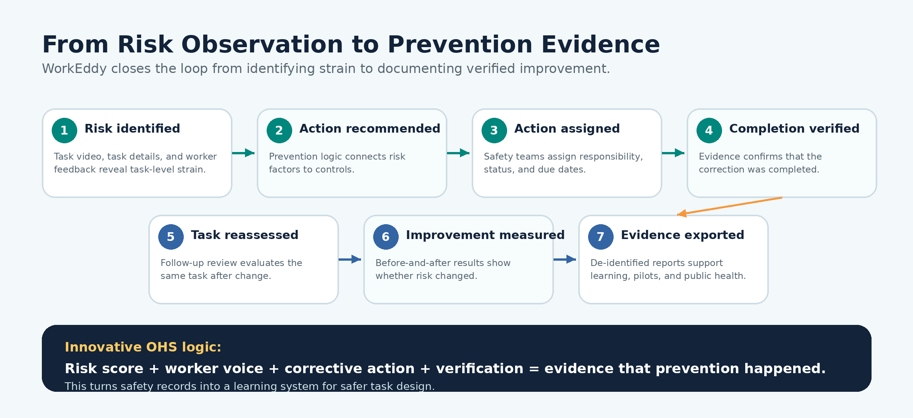
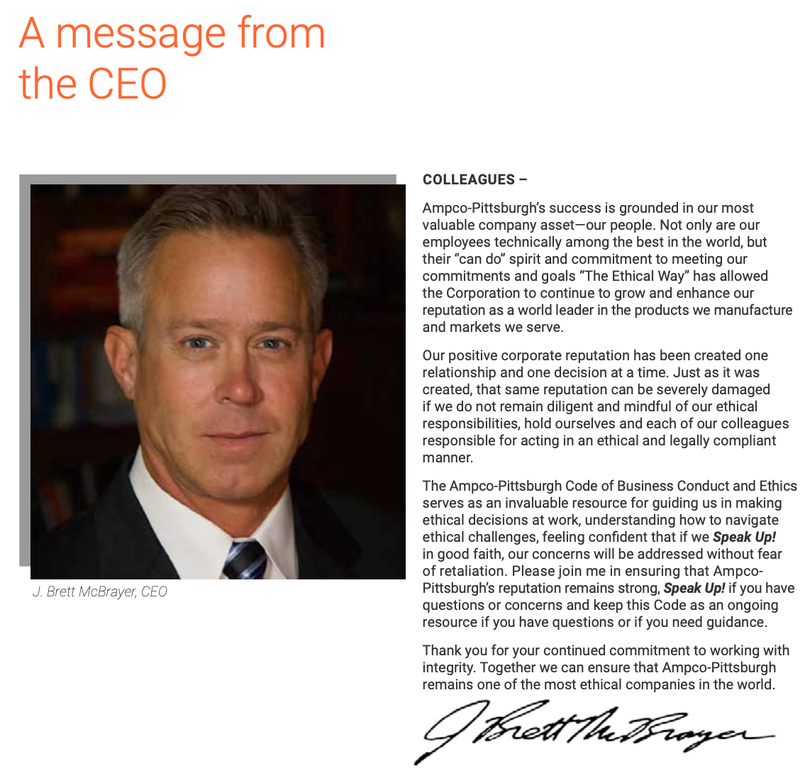
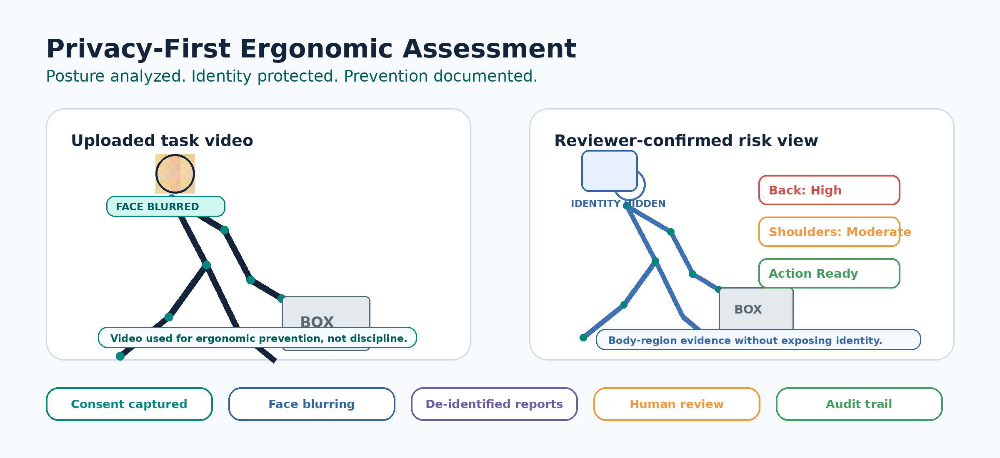
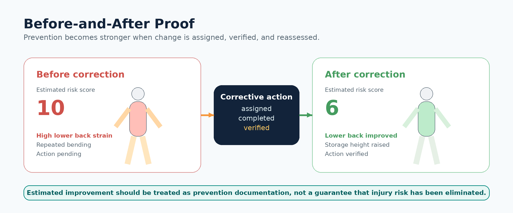
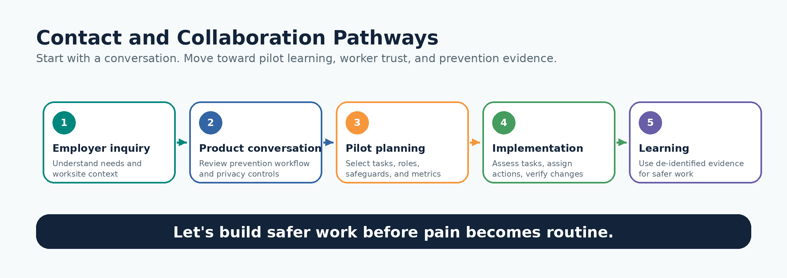

# WorkEddy

## About Us Dropdown Website Copy

**Our Company | Founder’s Message | Why Us | Contact Us**

# About Us

Above picture is the content in the About Us section with the dropdowns. Please find information for each dropdown below:

## Recommended About Us Dropdown Structure

Use the About Us menu as a short, trust-building path. The dropdown should help visitors quickly understand who WorkEddy is, why it exists, what makes it different, and how to start a conversation.

- **Our Company** - include About WorkEddy and What We Do.
- **Founder’s Message** - use the approved founder letter as a dedicated personal note.
- **Why Us** - explain why WorkEddy is different from checklist-only tools and surveillance-oriented systems.
- **Contact Us** - guide employers, researchers, pilot sites, and partners to the right next step.

## 1. Our Company

### About WorkEddy

WorkEddy is a human-centered occupational health prevention platform built for high-strain workplaces where physical work is demanding, repetitive, fast-paced, hot, or often overlooked.

We help organizations see how work tasks affect the body, identify ergonomic and heat-related risks, assign corrective actions, verify follow-through, and document measurable improvement while protecting worker dignity and privacy.

WorkEddy was created to move workplace safety from injury response to evidence-based prevention. Many organizations know when workers are hurting, but they do not always have a clear, trustworthy way to connect task-level strain to corrective action and documented improvement. WorkEddy fills that gap by bringing task video, ergonomic risk logic, body-region insights, worker discomfort reporting, corrective action tracking, before-and-after comparisons, privacy controls, and de-identified reporting into a single prevention system.

WorkEddy is not another checklist. It is a prevention-evidence platform designed to help organizations identify risks earlier, act faster, protect worker trust, and learn from corrections that make work safer.

### What We Do

WorkEddy helps high-strain workplaces turn risky tasks into prevention action.

The platform supports task-level review by helping safety teams capture or document work tasks, assess ergonomic risk, identify affected body regions, incorporate worker feedback, recommend corrective actions, assign responsibility, verify completion, and compare before-and-after results.

*WorkEddy prevention evidence workflow from risk identification to de-identified learning.*

WorkEddy helps organizations:

- Identify task-level ergonomic and heat stress risks.
- Understand where workers experience strain, discomfort, or exposure.
- Use reviewer-confirmed risk logic to support prevention decisions.
- Connect risk findings to corrective actions.
- Assign and track prevention actions.
- Verify completion with evidence.
- Compare before-and-after changes.
- Generate reports, dashboards, and de-identified prevention evidence.
- Support worker trust through consent, face blurring, role-based access, de-identification, and human review.

At its core, WorkEddy helps organizations identify strain, fix the task, verify improvement, and protect the worker.

> For the next section dropdown, create it like the picture below: I will send my signature separately on WhatsApp.

## 2. A Message from the Founder

WorkEddy began with a simple belief: no worker should have to keep hurting before the work itself is redesigned.

Too often, workplace injury prevention begins after pain has become normal, after a worker has learned to push through discomfort, or after a task has already caused harm. That delay has consequences. In 2024, private industry employers reported 2.5 million nonfatal workplace injuries and illnesses in the United States, and over the 2023 to 2024 period, overexertion, repetitive motion, and bodily conditions caused the highest number of DART cases among major event categories reported by the U.S. Bureau of Labor Statistics (BLS, 2026). WorkEddy was created to help change that pattern by moving prevention closer to the moment where risk first appears: the task itself.

We believe prevention should begin at the task level, where workers first experience strain, awkward posture, repetition, force, fatigue, and discomfort. NIOSH defines ergonomics as the design of work tasks and job demands to fit workers’ capabilities, with the goal of reducing and preventing musculoskeletal disorders caused by physical, psychosocial, and personal factors (CDC/NIOSH, 2024). For WorkEddy, that means prevention cannot rely only on incident reports, paper checklists, or after-the-fact documentation. It must help organizations see the task, understand the risk, listen to the worker, assign corrective action, and verify whether the work has actually improved.

WorkEddy brings task-level ergonomic risk assessment, worker feedback, corrective action tracking, follow-up review, and privacy safeguards into one prevention system. A warehouse worker repeatedly lifting, a hospital worker transferring patients, a delivery worker handling awkward loads, or a manufacturing worker repeating the same motion should not be protected only after an injury occurs. They need a system that helps safety teams identify risky task patterns, understand affected body regions, recommend controls, assign responsibility, document completion, and compare the work before and after corrective action.

What makes WorkEddy different is that it does not stop at identifying risk. It turns prevention into a visible, organized, and measurable process. A task can be captured, assessed, scored, reviewed, and connected to a corrective action plan. The platform can document what risk was found, which body regions were affected, what action was recommended, who was assigned to act, whether the action was completed, and whether follow-up review shows improvement. This matters because CDC/NIOSH describes an effective ergonomics program as a process that identifies and corrects ergonomic deficiencies, involves workers, measures effectiveness, and maintains management commitment (CDC/NIOSH Elements of Ergonomics Programs, 2024).

Over time, this creates prevention evidence that is more useful than a record of injury alone. Instead of waiting for pain reports to accumulate, employers and safety teams can track patterns such as high-risk tasks, repeated strain in a body region, delayed corrective actions, unresolved hazards, and reassessment changes following intervention. As WorkEddy pilots and implementation data grow, these measures can support case studies, safety dashboards, internal audits, and public health learning without reducing workers to numbers. WorkEddy is not technology for its own sake; it is a prevention trail that helps organizations see whether corrective action was completed, whether risk changed, and whether work was made safer.

### Global implications

The need for this kind of prevention is not only organizational; it is global. WHO reports that approximately 1.71 billion people worldwide live with musculoskeletal conditions and identifies these conditions as the leading contributor to disability worldwide (WHO, 2022). ILO estimates that nearly 3 million workers die every year from work-related accidents and diseases and that 395 million workers worldwide sustain nonfatal work injuries (ILO, 2023). For WorkEddy, these global realities reinforce a practical point: preventing strain at the task level is not only a workplace safety improvement; it is part of a larger public health effort to protect workers, preserve work ability, reduce preventable disability, and make prevention visible before harm becomes permanent.

WorkEddy is also built around worker trust. Video and digital tools should never make workers feel watched, blamed, or stripped of dignity. That is why WorkEddy is designed with consent, face blurring, de-identified reporting, role-based access, and human review. These safeguards align with the broader privacy principle that organizations should identify and manage privacy risk while building products and services that protect individuals (NIST Privacy Framework). In WorkEddy, privacy is not an added feature after the platform is built. It is part of the prevention model itself.

Our promise is to help organizations see risk earlier, respond with meaningful corrective action, and verify whether the work has improved. For employers, this means a clearer path from hazard recognition to follow-through. For safety teams, it means better documentation and more consistent ergonomic review. For researchers and public health leaders, it means more structured, task-level evidence on where strain occurs and which interventions may reduce it. For workers, it means the pain they feel is not ignored, blamed on them, or treated as the cost of doing the job.

WorkEddy is not claiming that software alone can eliminate workplace injury. Safer work also requires leadership commitment, worker involvement, job redesign, staffing support, training, equipment, and accountability. What WorkEddy offers is a way to make that prevention work easier to see, organize, measure, and harder to ignore.

*Prevention should not wait for injury. Worker pain should never become routine. Safer work must be visible, measurable, privacy-protective, and worthy of the people who do it.*

**Treasure James, DrPHc, MS, MSISD, MOSH**  
Founder, WorkEddy

## 3. Why Us

### Why WorkEddy

WorkEddy is built for organizations that want to move beyond documenting risk and start proving that prevention happened.

Many workplace safety tools identify hazards. WorkEddy is different because it connects risk identification to corrective action, verification, follow-up review, and evidence generation. It helps organizations move from observation to action, from action to verification, and from verification to measurable prevention learning.

*Privacy-first ergonomic assessment showing posture analysis with identity protection.*

### What Makes WorkEddy Different

**Prevention loop, not checklist.** WorkEddy does not stop at identifying risk. It helps safety teams assign corrective actions, verify completion, reassess the task, and document whether risk changed.

**Task-level visibility.** WorkEddy focuses on the work task itself, where strain, awkward posture, repetition, force, fatigue, heat, and discomfort first appear.

**Worker voice without worker blame.** Workers can report discomfort, task difficulty, and suggested changes in a structured way. The focus remains on task design, tools, workload, staffing, pace, exposure, and controls, not blaming the worker.

**Privacy-first prevention.** WorkEddy protects worker trust through consent, face blurring, de-identified reporting, secure access, role-based permissions, audit logs, and human review. The platform is designed for prevention, not surveillance.

**Human-reviewed technology.** AI-assisted features can support posture review and risk detection, but WorkEddy is designed around reviewer confirmation, explainability, and responsible use.

**Corrective action that can be tracked.** WorkEddy connects risk factors to recommended controls, assigns actions to responsible people, tracks status, collects evidence, and links completed actions to follow-up review.

*Before-and-after proof showing how corrective action can be linked to reassessment and documented improvement.*

**Before-and-after proof.** WorkEddy helps organizations compare baseline and follow-up assessments to determine whether a change improved performance on the task.

**Public health value.** De-identified prevention evidence can support pilots, research, employer learning, grant applications, safety dashboards, and broader occupational health improvement.

**Sustainable work design.** WorkEddy supports the idea that safer work is part of responsible stewardship. Protecting workers, redesigning harmful tasks, using resources thoughtfully, and reducing preventable harm all belong to a more sustainable future of work.

### Short Why Us Statement

Choose WorkEddy because prevention should not end with a risk score. It should lead to action, verification, learning, and safer work.

## 3. Contact Us

### Contact WorkEddy

Ready to make injury prevention more visible, measurable, and actionable?

We welcome inquiries from employers, safety professionals, researchers, public health leaders, worker organizations, pilot sites, and partners interested in task-level ergonomic prevention, heat-risk prevention, privacy-first assessment, corrective-action tracking, and prevention evidence.

Contact WorkEddy to request a pilot, schedule a product conversation, discuss research collaboration, ask about privacy and worker trust, or explore partnership opportunities.

### Email

**Primary website email:** hello@workeddy.com  
**Pilot inquiries:** pilots@workeddy.com  
**Privacy inquiries:** privacy@workeddy.com  
**Research inquiries:** research@workeddy.com

*Contact pathways from first inquiry to pilot learning and de-identified prevention evidence.*

### Suggested Contact Form Fields

- Name
- Organization
- Email Address
- Role or Title
- Industry
- Reason for Contact
- Message

### Reason for Contact Options

- Request a Pilot
- Schedule a Demo
- Research Collaboration
- Employer Inquiry
- Privacy or Worker Trust Question
- Partnership Opportunity
- General Question

### Suggested Button Text

- Send Message
- Request a Pilot
- Talk to WorkEddy
- Explore a Demo

### Suggested Closing Line

Let’s build safer work before pain becomes routine.
