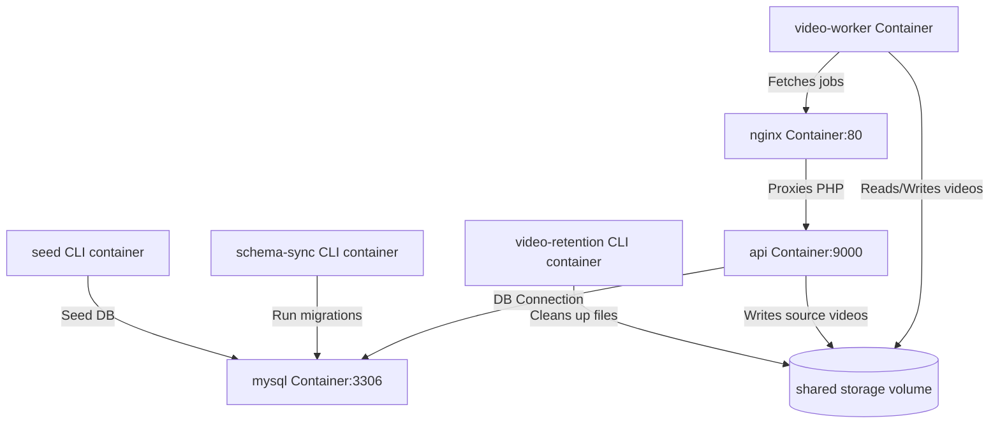

# Design Specification: V2 Docker Setup and Configuration

This document specifies the container and environment configurations required to run the WorkEddy SaaS v2 platform locally and in target hosting environments like Hostinger.

## Objectives
1. Provide a `docker-compose.yml` for local and containerized staging environments.
2. Provide a `.env.example.docker` template configured for container orchestration out-of-the-box.
3. Migrate CLI runner definitions (database migrations, seeds, video workers, and video retention tasks) to v2-compliant console commands.

## Architecture & Container Configuration

### Services Diagram

### Services Details

- **nginx**: Uses `nginx:1.27-alpine`. Proxies PHP-FPM requests to the `api` container. Serves static files and shares the storage volume to serve processed assessment videos.
- **api**: Runs the core WorkEddy PHP-FPM runtime. Integrates automatic migrations via its entrypoint, and mounts the live workspace code with caching mechanisms.
- **schema-sync**: A transient container running `php bin/console doctrine:migrations:migrate --no-interaction --allow-no-migration` to verify migrations.
- **seed**: Runs the `php bin/console db:seed --no-interaction` command under the `ops` profile.
- **video-worker**: Python container compiling MediaPipe dependencies. Pulls jobs from the PHP control plane via `http://nginx` and processes video overlays in the shared volume.
- **video-retention**: Background cron loop running `php bin/console privacy:video-retention:enforce` periodically.
- **mysql**: Standard MySQL 8.4 database, mapping port 3307 on the host.

## Environment Variables Configuration (`.env.example.docker`)
The `.env.example.docker` file contains pre-configured docker-network hostnames:
- `DB_HOST=mysql`
- `DB_PORT=3306`
- `WORKER_API_BASE_URL=http://nginx`
- `WorkEddy_VIDEO_WORKER_STORAGE_ROOT=/storage`
